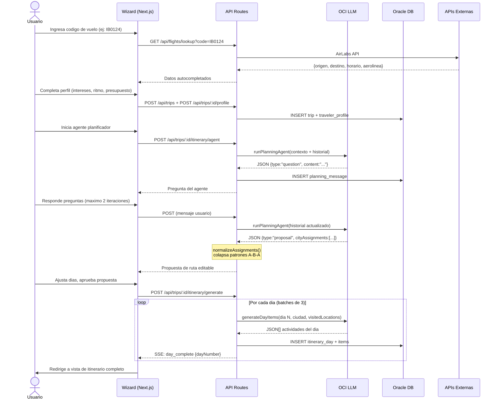

# Arquitectura — TripPlan

## Diagrama de flujo principal

```mermaid
flowchart TD
    subgraph Cliente["Cliente (Next.js 14 App Router)"]
        UI["UI / React Components"]
        WIZARD["Wizard: Nuevo Viaje\n(vuelo autocomplete, perfil viajero)"]
        AGENT_UI["Chat: Agente Planificador\n(propuesta editable + preview de ciudades)"]
        ITIN_UI["Vista de Itinerario\n(dias, actividades, album de fotos)"]
    end

    subgraph API["Next.js API Routes (Server)"]
        AUTH_API["/api/auth — NextAuth.js v5"]
        TRIPS_API["/api/trips — CRUD viajes"]
        AGENT_API["/api/trips/:id/itinerary/agent\n(chat multi-turno)"]
        GEN_API["/api/trips/:id/itinerary/generate\n(SSE streaming)"]
        FLIGHT_API["/api/flights/lookup"]
        CITIES_API["/api/cities/preview"]
        MEDIA_API["/api/trips/:id/media"]
    end

    subgraph LLM["OCI Generative AI (Cohere Command R+)"]
        PLANNER["runPlanningAgent()\nPrompt → JSON propuesta de ruta"]
        DAYGEN["generateItinerary()\nPrompt x N dias → JSON actividades"]
        SUGGEST["suggestItemAlternative()\nPrompt → alternativa de actividad"]
    end

    subgraph EXT["Servicios Externos"]
        AIRLABS["AirLabs API\nDatos de vuelos por codigo IATA"]
        WIKI["Wikipedia REST API\nDescripcion + imagenes de ciudades"]
    end

    subgraph DB["Oracle Autonomous DB 26ai"]
        USERS_T["USERS"]
        TRIPS_T["TRIPS + PARTICIPANTS"]
        PROFILE_T["TRAVELER_PROFILES"]
        ITIN_T["ITINERARY_DAYS + ITEMS"]
        MEDIA_T["TRIP_MEDIA"]
        MSG_T["PLANNING_MESSAGES"]
    end

    UI --> AUTH_API
    WIZARD --> FLIGHT_API
    WIZARD --> TRIPS_API
    AGENT_UI --> AGENT_API
    AGENT_UI --> CITIES_API
    AGENT_UI --> GEN_API
    ITIN_UI --> MEDIA_API

    AUTH_API --> USERS_T
    TRIPS_API --> TRIPS_T
    TRIPS_API --> PROFILE_T

    AGENT_API --> PLANNER
    AGENT_API --> MSG_T
    PLANNER -->|"JSON {type, proposal}"| AGENT_API

    GEN_API --> DAYGEN
    DAYGEN -->|"JSON[] items/dia"| GEN_API
    GEN_API -->|"SSE event: day_complete"| AGENT_UI
    GEN_API --> ITIN_T

    ITIN_UI --> SUGGEST
    SUGGEST -->|"JSON alternativa"| ITIN_UI

    FLIGHT_API --> AIRLABS
    CITIES_API --> WIKI

    MEDIA_API --> MEDIA_T
```

---

## Decisiones de stack y trade-offs

### Next.js 14 App Router (fullstack)
**Por que:** Permite tener API Routes y React en el mismo repositorio. Server Components para SSR sin re-fetching innecesario. No requiere backend separado para un MVP.  
**Trade-off:** El bundle de servidor crece con dependencias pesadas (oracledb, oci-common). En produccion se mitiga con funciones serverless de Railway.

### OCI Generative AI — Cohere Command R+
**Por que:** Acceso incluido en la cuenta de Oracle Cloud sin costo adicional. El modelo entiende JSON estructurado y respeta schemas complejos mejor que modelos mas pequeños.  
**Trade-off:** La firma HTTP (RSA-SHA256) es manual, no hay SDK oficial para Node.js. Se implemento en `oci-ai.ts`. Latencia aproximada de 2-4s por llamada.  
**Alternativa considerada:** OpenAI GPT-4o — descartado por costo en produccion con multiples usuarios.

### Oracle Autonomous Database 26ai
**Por que:** La misma instancia ya existia para otro proyecto. Reutilizarla reduce costos a cero extra.  
**Trade-off:** Oracle requiere wallet TLS y cliente nativo (`oracledb`), lo que complica el deploy en entornos serverless. Se resolvio embebiendo el wallet en el repositorio y configurando `ORACLE_WALLET_DIR`.

### AirLabs API (vuelos)
**Por que:** API REST con clave, cubre mas del 90% de aerolineas internacionales. Permite autocompletar datos de vuelo por codigo IATA (ej: IB0124 → origen, destino, horario).  
**Trade-off:** Tier gratuito con cuota mensual limitada. Normalizacion manual de codigos necesaria (IB0124 → IB124 segun estandar IATA).

### Wikipedia REST API (ciudades)
**Por que:** Gratuita, sin clave, cacheable. Provee descripcion e imagenes de landmarks para que el usuario evalúe cuantos dias asignar a cada ciudad.  
**Trade-off:** Imagenes de calidad variable. Se filtran con heuristicas por palabras clave (se excluyen resultados de personas, aeropuertos, etc.).

### Streaming SSE para generacion de itinerario
**Por que:** Generar 25 dias multiplicado por una llamada al LLM tarda entre 2 y 5 minutos. Sin streaming el usuario ve una pantalla en blanco. Con SSE recibe actualizaciones `day_complete` en tiempo real.  
**Trade-off:** Node.js en Railway puede cortar conexiones largas. Se maneja con `controller.close()` defensivo y guardado parcial en base de datos.

---

## Flujo end-to-end del caso de uso principal

